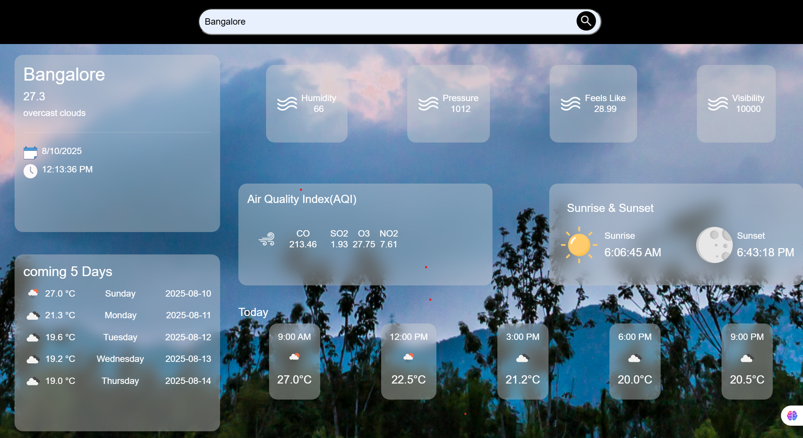

# 🌤 Weather Report App

A responsive and modern **Weather Report Application** built using **HTML, CSS, JavaScript**, and the **OpenWeatherMap API**.  
It displays **current weather**, **5-day forecast**, **hourly forecast**, **Air Quality Index (AQI)**, sunrise/sunset times, and additional weather metrics.



---

## 📌 Features
- 🔍 **City Search** – Enter a city name to get instant weather details.
- 🌡 **Current Weather** – Temperature, sky description, humidity, pressure, feels-like, and visibility.
- 📅 **5-Day Forecast** – Daily temperature, weather icons, and dates.
- ⏳ **Hourly Forecast** – Upcoming hours' temperature and weather icons for the current day.
- 🌬 **Air Quality Index (AQI)** – CO, SO₂, O₃, and NO₂ levels.
- 🌅 **Sunrise & Sunset Times** – Displays exact times for the searched city.
- 📱 **Responsive Design** – Works seamlessly on mobile and desktop.

---

## 🛠 Tech Stack
- **HTML5** – Structure of the application.
- **CSS3** – Styling with responsiveness and glassmorphism effect.
- **JavaScript (ES6)** – Fetching and displaying API data dynamically.
- **Bootstrap 5** – Layout and components.
- **jQuery** – DOM manipulation.
- **OpenWeatherMap API** – Weather and AQI data.

---

## 📦 Installation & Usage
1. **Clone the repository**
   ```bash
   git clone https://github.com/yourusername/weather-report-app.git
   cd weather-report-app
